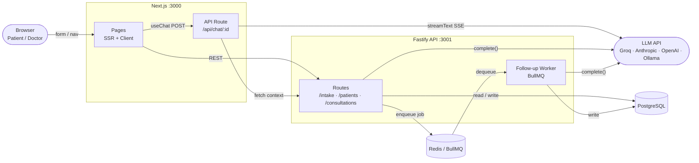
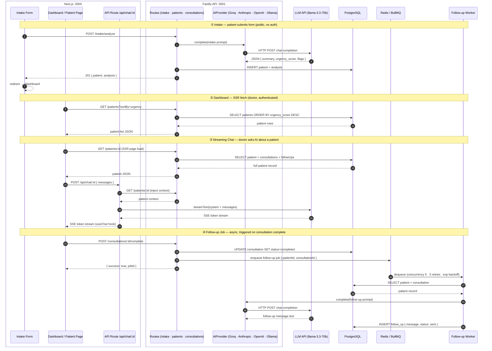

# MedFlow AI

A telehealth patient management platform powered by AI — built as a full-stack portfolio project demonstrating multi-provider AI integration, real-time streaming, and async background job processing.

> **Disclaimer:** This is a proof-of-concept only. No real patient data is processed or stored. Not intended for clinical use.

---

## Overview

MedFlow AI simulates a weight-management clinic's intake workflow:

1. **Patient submits an intake form** — symptoms, medications, weight history
2. **AI analyzes the intake** — generates a clinical summary, urgency score (1–5), and clinical flags
3. **Doctor reviews the prioritized queue** — high-urgency patients surface at the top
4. **Doctor chats with an AI assistant** — streaming, context-aware responses grounded in the patient record
5. **Consultation is marked complete** — a background job asynchronously generates a follow-up message





---

## Tech Stack

| Layer | Technology |
|---|---|
| Frontend | Next.js 16, Tailwind CSS v4, shadcn/ui |
| Backend | Fastify 5, TypeScript |
| Database | PostgreSQL 16 + Prisma 6 |
| Queue | BullMQ + Redis 7 |
| AI (default) | Groq (`llama-3.3-70b-versatile`) |
| AI Streaming | Vercel AI SDK v6 |
| Auth | NextAuth.js v5 |
| Monorepo | pnpm workspaces + Turborepo |
| Error tracking | Sentry (optional, free tier) |

---

## Quick Start

### Prerequisites

- Node.js ≥ 20
- pnpm ≥ 10
- Docker + Docker Compose
- A free [Groq API key](https://console.groq.com)

### 1. Clone and install

```bash
git clone https://github.com/YOUR_USERNAME/medflow-ai.git
cd medflow-ai
pnpm install
```

### 2. Configure environment

```bash
cp .env.example .env
```

Edit `.env` — at minimum set your Groq key:

```env
GROQ_API_KEY=gsk_...
```

### 3. Start infrastructure

```bash
docker-compose up -d
```

This starts PostgreSQL on port 5432 and Redis on port 6379.

### 4. Run database migrations and seed

```bash
pnpm --filter api db:generate
pnpm --filter api db:migrate
pnpm --filter api db:seed
```

The seed script creates 10 realistic weight-management patients with varied urgency scores.

### 5. Start the apps

```bash
pnpm dev
```

| App | URL |
|---|---|
| Dashboard | http://localhost:3000 |
| API | http://localhost:3001 |
| Bull Board (queue UI) | http://localhost:3001/admin/queues |

**Demo credentials:** `doctor@medflow.demo` / `demo1234`

---

## AI Architecture Decisions

### Why an AIProvider interface?

All AI providers implement a single interface:

```typescript
interface AIProvider {
  complete(prompt: string, system?: string): Promise<string>
  stream(prompt: string, system?: string): AsyncIterable<string>
}
```

Switching providers requires only changing the `AI_PROVIDER` environment variable — no code changes.

### Why Groq as the default?

- Free tier with generous rate limits (no credit card required)
- `llama-3.3-70b-versatile` delivers strong clinical reasoning
- Low latency (tokens/s well above average) — important for streaming chat UX

### Why Vercel AI SDK for streaming?

The `streamText` + `toUIMessageStreamResponse()` pattern handles chunked transfer encoding, error boundaries, and abort signals out of the box. The `useChat` hook on the client manages message state, streaming status, and retry logic with a few lines of code.

### Zod validation on AI responses

The intake analyzer wraps every AI response in a Zod schema parse. On failure (malformed JSON, missing fields) it returns a deterministic fallback object instead of crashing — critical for production resilience.

### BullMQ for async follow-ups

Follow-up generation is offloaded to a BullMQ worker with:
- **3 retry attempts** with exponential backoff (initial delay 5 s)
- **Concurrency 5** — handles bursts without overwhelming the AI provider
- Retry behavior is visible in the Bull Board UI at `/admin/queues`

---

## Switching AI Providers

Set `AI_PROVIDER` in `.env` and add the corresponding API key. No code changes needed.

| Provider | `AI_PROVIDER` value | Key variable | Cost |
|---|---|---|---|
| **Groq** (default) | `groq` | `GROQ_API_KEY` | Free tier |
| Anthropic Claude | `anthropic` | `ANTHROPIC_API_KEY` | Paid |
| OpenAI GPT-4o | `openai` | `OPENAI_API_KEY` | Paid |
| Ollama (local) | `ollama` | `OLLAMA_BASE_URL`, `OLLAMA_MODEL` | Free (self-hosted) |

The Ollama provider uses only raw `fetch` — no API key, 100% offline.

---

## Project Structure

```
medflow-ai/
├── apps/
│   ├── api/                  # Fastify API server
│   │   ├── prisma/           # Schema + seed
│   │   └── src/
│   │       ├── lib/ai/       # AIProvider interface + implementations
│   │       ├── routes/       # intake, patients, consultations
│   │       ├── services/     # intakeAnalyzer
│   │       └── workers/      # followUpWorker (BullMQ)
│   └── web/                  # Next.js frontend
│       ├── app/
│       │   ├── dashboard/    # SSR patient queue
│       │   ├── intake/       # Public intake form
│       │   ├── patients/[id] # Patient detail + streaming chat
│       │   └── api/chat/     # Vercel AI SDK streaming route
│       └── components/
│           ├── layout/       # Sidebar, Header
│           └── patients/     # PatientQueue, AIStreamChat, FollowUpList
└── packages/
    └── shared/               # Shared TypeScript types + Zod schemas
```

---

## HIPAA Awareness

This project is a **proof-of-concept** and does **not** meet HIPAA compliance requirements. A production system handling real patient data would require:

- End-to-end encryption at rest and in transit (TLS 1.2+, AES-256)
- Business Associate Agreements (BAA) with all AI providers
- Audit logging for all data access
- Role-based access control beyond the demo credentials
- Data residency controls (US-only infrastructure)
- Regular penetration testing and risk assessments

---

## License

MIT
